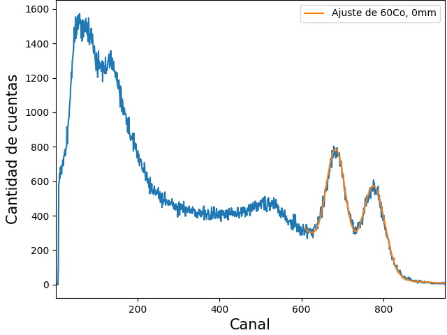
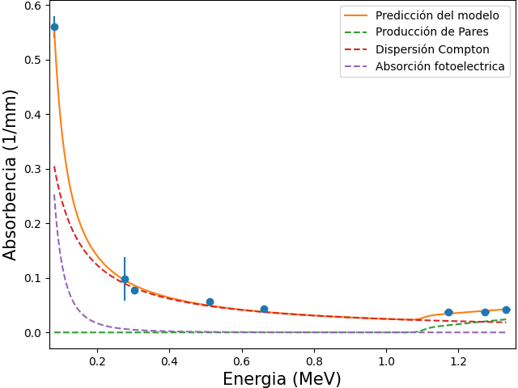
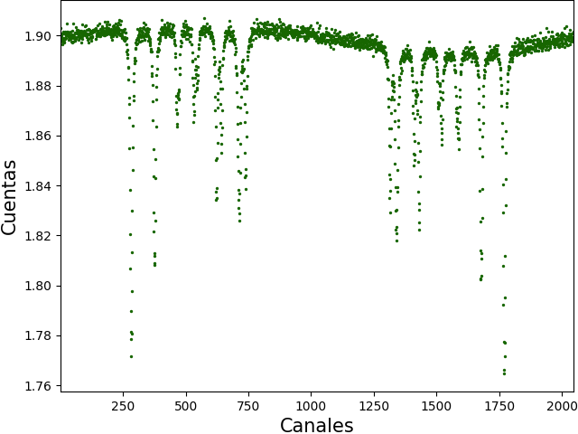
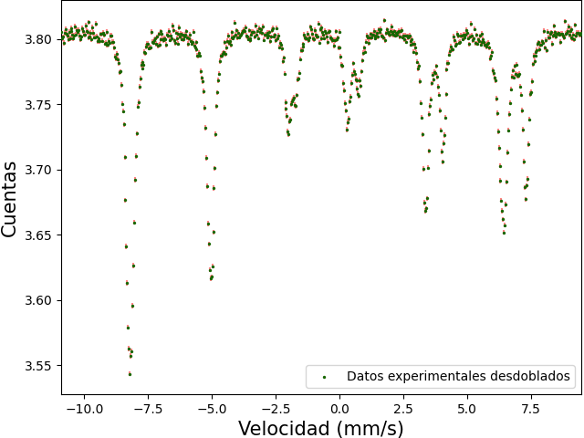
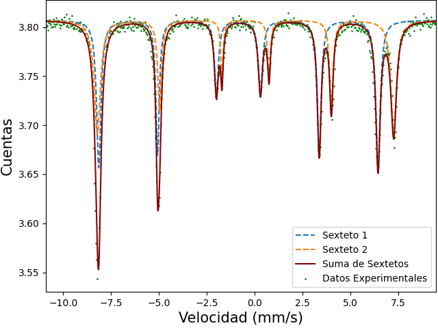

# Experimento 1 (Espectroscopía Gamma)
Espectro de una muestra de Co sin placas de Cobre y absorbancia según energía.

                                                                   

# Experimento 2 (Mossbauer)
Espectro desdoblado y doblado en la espectroscopía Mossbauer

            

Ajuste de Mossbauer

  

# Experimento 3 (Pals) --Proximamente--
